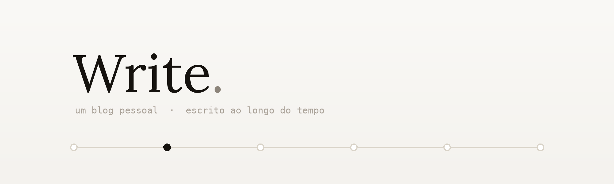
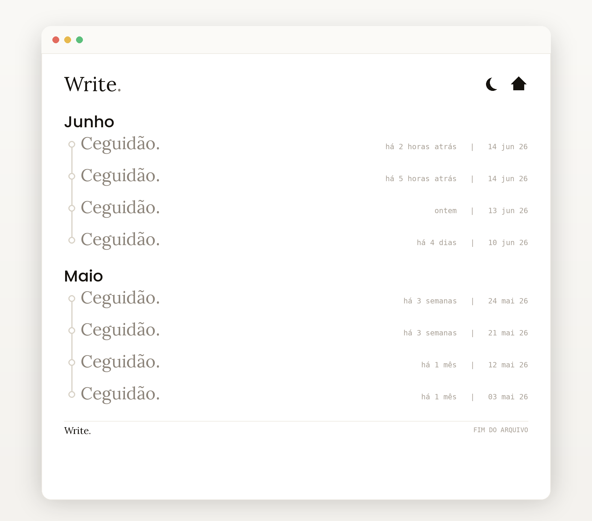
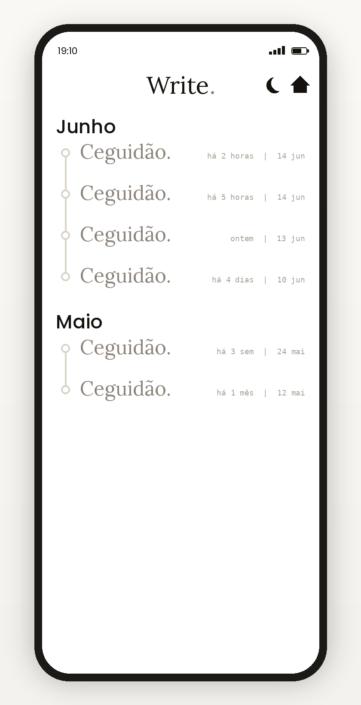

<p align="center">
  
</p>

# Write.

Write é um blog desenvolvido para uso pessoal, onde o autor piblicará pensamentos, reflexões e poemas. A ideia é fazer com que lembranças e ideais nunca sejam perdidas. Por isso foi criada a Write

<p align="center">
  <a href="https://write-w.vercel.app"><strong>🔗 Acessar o site →</strong></a>
</p>

## Propósito

Um espaço calmo para escrever ao longo do tempo. Em vez de uma lista comum, os
textos aparecem como uma **linha do tempo**, o que dá um sentido de continuidade
— da escrita mais recente à mais antiga. Por enquanto é a camada visual
(front-end) do projeto.

## Funcionalidades

- **Linha do tempo por mês** — posts como nós conectados por uma linha contínua.
- **Tipografia com duas vozes** — serifa nos títulos, monoespaçada nas datas.
- **Responsivo** — folha centralizada no desktop; tela cheia no celular (≤ 640px), como no protótipo.
- **Efeitos leves** — surgimento em cascata no carregamento, realce no hover e cabeçalho fixo.
- **Acessível** — foco visível por teclado, rótulos `aria` e respeito a `prefers-reduced-motion`.

## Tecnologias

- **React 19** + **TypeScript**
- **Vite** (dev e build)
- **CSS puro** com variáveis de tema
- **Google Fonts** — Playfair Display · Inter · JetBrains Mono
- **Deploy:** Vercel

## Preview

<table>
  <tr>
    <td width="62%" valign="top"></td>
    <td width="38%" valign="top"></td>
  </tr>
</table>

## Como rodar

Precisa de [Node.js](https://nodejs.org) 18+.

```bash
npm install
npm run dev      # http://localhost:5173
```
