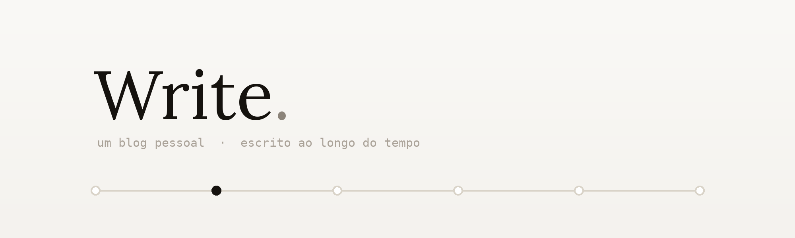
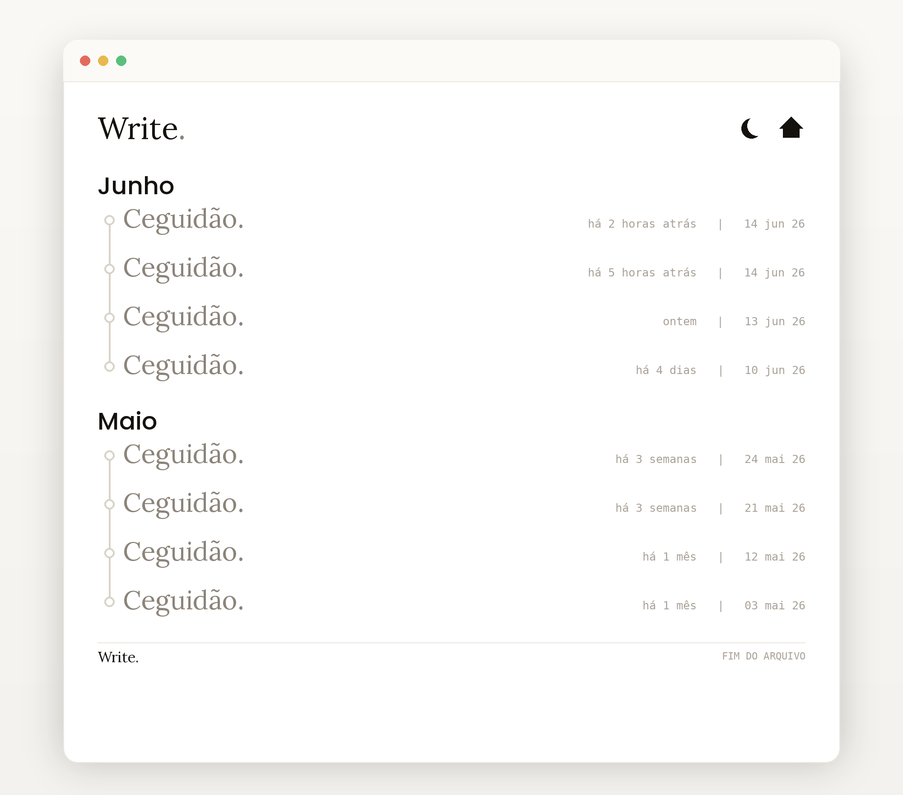
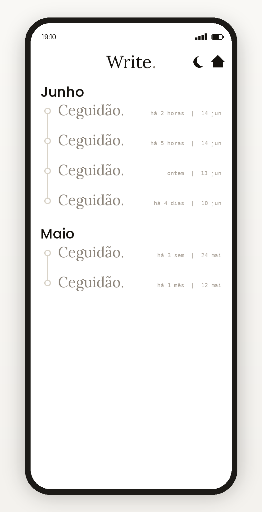

<p align="center">
  
</p>

<h1 align="center">Write.</h1>

<p align="center">
  Um espaço calmo para guardar pensamentos, reflexões e poemas.
</p>

<p align="center">
  <a href="https://write-w.vercel.app"><strong>Acessar o site</strong></a>
  &nbsp;·&nbsp;
  <a href="#como-rodar">Rodar localmente</a>
  &nbsp;·&nbsp;
  <a href="#api">API</a>
</p>

<p align="center">
  
  
  
  
  
</p>

---

## Sobre

O Write é um blog pessoal onde o autor publica pensamentos, reflexões e poemas. Ele nasceu para que lembranças e ideias nunca se percam.

Os textos podem ser lidos de duas formas. Em **destaques**, o texto mais recente ganha espaço de capa. Na **linha do tempo**, todos aparecem em ordem cronológica, agrupados por mês, da escrita mais recente à mais antiga.

## Preview

<table>
  <tr>
    <td width="62%" valign="top"></td>
    <td width="38%" valign="top"></td>
  </tr>
</table>

## Funcionalidades

| | |
|---|---|
| **Dois modos de leitura** | Destaques, com o texto mais recente em evidência, ou linha do tempo, agrupada pelo mês real de cada publicação. O modo escolhido fica salvo na URL. |
| **Categorias** | Vida, Poemas, Trabalho e Romance, cada uma com sua cor. Dá para filtrar pelo menu ou pela lateral. |
| **Editor de texto** | Formatação com Quill, painel com categoria e tags, rascunhos e publicação direto na API. |
| **Página de leitura** | Tipografia pensada para textos longos, tempo de leitura estimado, tags e link para o próximo texto. |
| **Meus artigos** | Lista do que já foi publicado e dos rascunhos em andamento. |
| **Tema claro e escuro** | Segue o sistema na primeira visita e lembra a escolha depois. |
| **Responsivo** | Folha larga com colunas no desktop e tela cheia no celular, com menu lateral. |
| **Acessível** | Foco visível por teclado, rótulos `aria` e respeito a `prefers-reduced-motion`. |

## Tecnologias

**Front-end**
- React 19 e TypeScript
- Vite
- React Router
- React Quill (editor)
- CSS puro com variáveis de tema
- Fontes: Playfair Display (marca), Lora (textos), Inter (interface) e JetBrains Mono (datas)

**Back-end**
- Node.js puro, sem framework, com um roteador próprio
- PostgreSQL em produção e SQLite (`node:sqlite`) no ambiente local

**Deploy**
- Front-end na Vercel
- API no Render

## Estrutura

```
.
├── front-end/
│   ├── docs/                 # banner e imagens do README
│   ├── src/
│   │   ├── components/
│   │   │   ├── home/         # destaques, linha do tempo, filtros
│   │   │   ├── layout/       # cabeçalho, menu lateral, rodapé
│   │   │   └── pages/        # início, artigo, editor, meus artigos, perfil
│   │   ├── hooks/            # useArtigos, useTema
│   │   ├── lib/              # chamadas à API, datas, categorias
│   │   └── styles/
│   └── vercel.json
│
└── back-end/
    ├── controllers/
    ├── database/
    ├── routes/
    ├── services/
    ├── router.mjs
    └── server.mjs
```

## Como rodar

Você vai precisar do [Node.js](https://nodejs.org) **22.5 ou superior**, porque o back-end usa o módulo nativo `node:sqlite`.

**1. API**

```bash
cd back-end
npm install
npm start          # http://localhost:3000
```

Sem a variável `DATABASE_URL`, a API cria e usa o arquivo local `banco.db`. Com ela, conecta no PostgreSQL.

**2. Front-end**

```bash
cd front-end
npm install
cp .env.example .env   # aponta para a API local
npm run dev            # http://localhost:5173
```

### Variáveis de ambiente

| Onde | Variável | Para que serve |
|---|---|---|
| `front-end/.env` | `VITE_API_URL` | Endereço da API. Sem ela, o front usa a API publicada no Render. |
| `back-end/.env` | `DATABASE_URL` | Conexão com o PostgreSQL. Sem ela, usa SQLite local. |
| `back-end/.env` | `PORT` | Porta do servidor. O padrão é `3000`. |

## API

| Método | Rota | O que faz |
|---|---|---|
| `GET` | `/` | Confere se a API está no ar |
| `GET` | `/documentos` | Lista os textos publicados, do mais recente ao mais antigo |
| `POST` | `/publicar` | Publica um novo texto |

**Exemplo de publicação**

```json
POST /publicar
{
  "titulo": "O peso do silêncio",
  "conteudoHtml": "<p>Há silêncios que não são vazios…</p>"
}
```

## Próximos passos

- [ ] Salvar categoria e tags no banco
- [ ] Rota para buscar um texto por `id`
- [ ] Editar e excluir textos publicados
- [ ] Rascunhos salvos na API, e não só no navegador
- [ ] Imagem de capa nos artigos

---

<p align="center">
  <sub>Feito com calma, um texto de cada vez.</sub>
</p>
