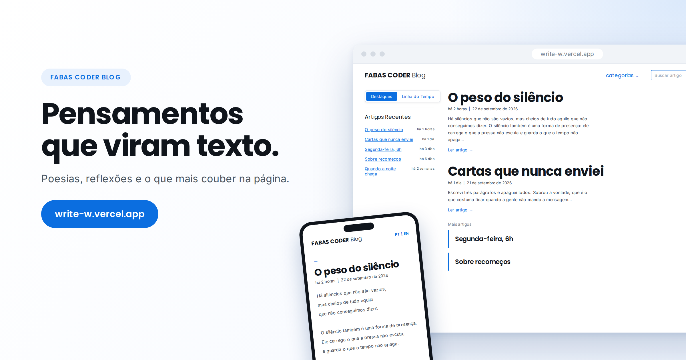
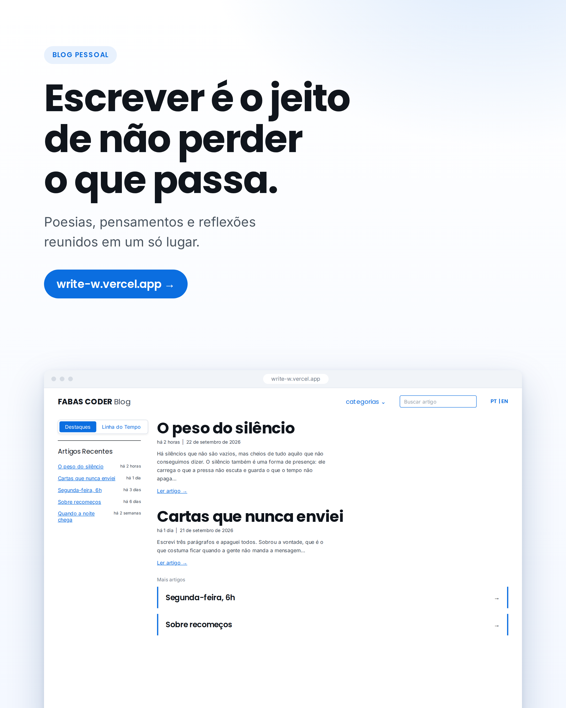

<p align="center">
  
</p>

<h1 align="center">FABAS CODER Blog</h1>

<p align="center">
  Pensamentos que viram texto. Poesias, reflexões e o que mais couber na página.
</p>

<p align="center">
  <a href="https://write-w.vercel.app"><strong>Acessar o site</strong></a>
  &nbsp;·&nbsp;
  <a href="#como-rodar">Rodar localmente</a>
  &nbsp;·&nbsp;
  <a href="#api">API</a>
</p>

<p align="center">
  
  
  
  
  
</p>

---

## Sobre

O Fabas Coder Blog é um blog pessoal feito do zero, front-end e back-end, para guardar poesias, pensamentos e reflexões. A ideia é simples: o que é escrito não se perde.

Os textos podem ser lidos de duas formas. Em **destaques**, os mais recentes aparecem em tamanho de capa, com um trecho de abertura. Na **linha do tempo**, todos aparecem em ordem cronológica, agrupados pelo mês em que foram publicados.

<p align="center">
  
  
</p>

## Funcionalidades

| | |
|---|---|
| **Dois modos de leitura** | Destaques ou linha do tempo por mês, com a escolha guardada na própria URL. |
| **Categorias e busca** | Filtro por Pensamentos, Poesias, Reflexões, Romance e Trabalho, além de busca por título e conteúdo. |
| **Área do autor** | O botão *Access*, no rodapé, abre o login e libera a escrita e o gerenciamento dos artigos. |
| **Editor de texto** | Formatação com Quill, categoria, tags e rascunhos salvos no navegador. |
| **Publicar, editar e excluir** | Publicação de novos artigos, edição de textos já no ar e exclusão com confirmação. |
| **Responsivo** | Layout em colunas no desktop e menu recolhível no celular. |
| **Acessível** | Foco visível por teclado, rótulos `aria` e respeito a `prefers-reduced-motion`. |

## Tecnologias

**Front-end** — React 19, TypeScript, Vite, React Router, React Quill e CSS puro com variáveis de tema. Tipografia em Poppins e Inter.

**Back-end** — Node.js puro, sem framework, com roteador próprio. PostgreSQL em produção e SQLite (`node:sqlite`) no ambiente local.

**Deploy** — Front-end na Vercel e API no Render.

## Estrutura

```
.
├── front-end/
│   ├── src/
│   │   ├── assets/           # imagens e artes de divulgação
│   │   ├── components/
│   │   │   ├── admin/        # barra do autor e dados de acesso
│   │   │   ├── home/         # destaques, linha do tempo, filtros
│   │   │   ├── layout/       # cabeçalho, rodapé, modais
│   │   │   └── pages/        # início, artigo, editor, rascunhos
│   │   ├── hooks/            # useArtigos, useAdmin
│   │   ├── lib/              # API, datas, categorias, acesso
│   │   └── styles/
│   └── vercel.json
│
└── back-end/
    ├── controllers/
    ├── database/
    ├── routes/
    ├── services/
    ├── router.mjs
    └── server.mjs
```

## Como rodar

É preciso ter o [Node.js](https://nodejs.org) **22.5 ou superior**, porque o back-end usa o módulo nativo `node:sqlite`.

**1. API**

```bash
cd back-end
npm install
npm start          # http://localhost:3000
```

Sem a variável `DATABASE_URL`, a API cria e usa o arquivo local `banco.db`. Com ela, conecta no PostgreSQL.

**2. Front-end**

```bash
cd front-end
npm install
cp .env.example .env
npm run dev        # http://localhost:5173
```

### Variáveis de ambiente

| Onde | Variável | Para que serve |
|---|---|---|
| `front-end/.env` | `VITE_API_URL` | Endereço da API. Sem ela, usa a API publicada no Render. |
| `front-end/.env` | `VITE_ADMIN_EMAIL` · `VITE_ADMIN_SENHA` | Dados de acesso da área do autor. |
| `back-end/.env` | `DATABASE_URL` | Conexão com o PostgreSQL. Sem ela, usa SQLite local. |
| `back-end/.env` | `PORT` | Porta do servidor. O padrão é `3000`. |

> O login é conferido no próprio navegador, porque a API ainda não tem rota de autenticação. Ele esconde a área de escrita de quem visita, mas não substitui uma proteção no servidor.

## API

| Método | Rota | O que faz |
|---|---|---|
| `GET` | `/` | Confere se a API está no ar |
| `GET` | `/documentos` | Lista os artigos, do mais recente ao mais antigo |
| `POST` | `/publicar` | Publica um novo artigo |
| `PUT` | `/documentos/:id` | Edita um artigo publicado |
| `DELETE` | `/documentos/:id` | Apaga um artigo publicado |

**Corpo de publicação e edição**

```json
{
  "titulo": "O peso do silêncio",
  "conteudoHtml": "<p>Há silêncios que não são vazios…</p>",
  "categoria": "poesias",
  "tags": ["silêncio", "poesia"]
}
```

## Próximos passos

- [ ] Salvar categoria e tags no banco
- [ ] Rota de login com token na API
- [ ] Buscar um artigo por `id` direto na API
- [ ] Rascunhos salvos no servidor, e não só no navegador
- [ ] Imagem de capa nos artigos
- [ ] Versão em inglês (o seletor PT | EN já está no layout)

---

<p align="center">
  <sub>Feito por Fabas Coder · um texto de cada vez.</sub>
</p>
