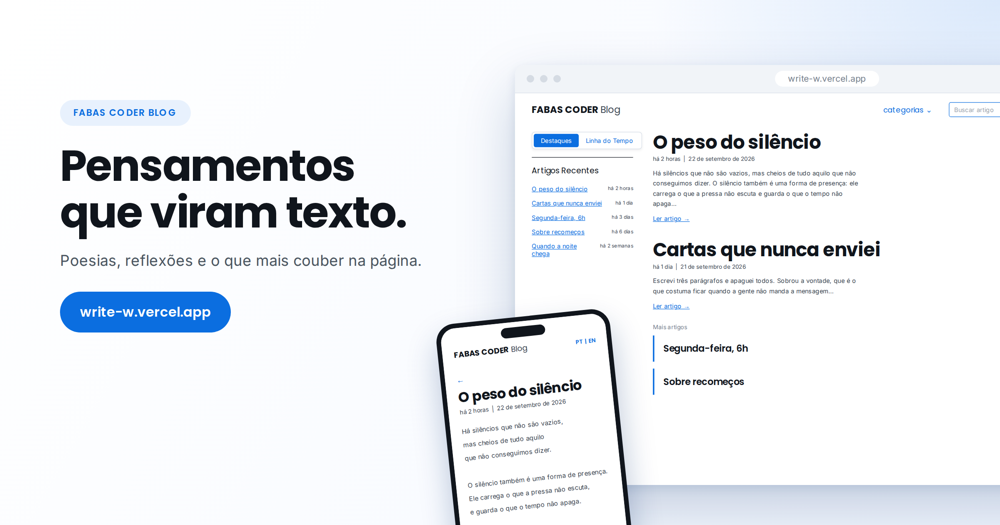
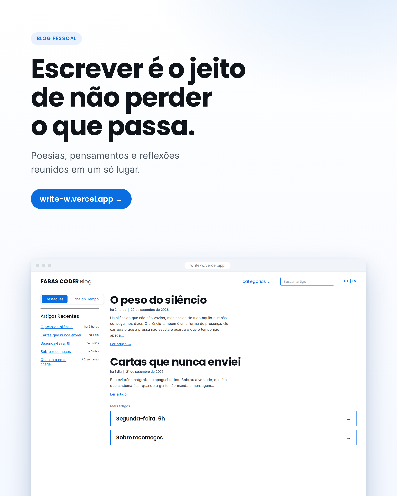

<p align="center">
  
</p>

<h1 align="center">FABAS CODER Blog</h1>

<p align="center">
  Pensamentos que viram texto. Poesias, reflexões e o que mais couber na página.
</p>

<p align="center">
  <a href="https://write-w.vercel.app"><strong>Acessar o site</strong></a>
  &nbsp;·&nbsp;
  <a href="#como-rodar">Rodar localmente</a>
  &nbsp;·&nbsp;
  <a href="#api">API</a>
</p>

<p align="center">
  
  
  
  
  
</p>

---

## Sobre

O Fabas Coder Blog é um blog pessoal feito do zero, front-end e back-end, para guardar poesias, pensamentos e reflexões. A ideia é simples: o que é escrito não se perde.

Os textos podem ser lidos de duas formas. Em **destaques**, os mais recentes aparecem em tamanho de capa, com um trecho de abertura. Na **linha do tempo**, todos aparecem em ordem cronológica, agrupados pelo mês em que foram publicados.

<p align="center">
  
  
</p>

## Funcionalidades

| | |
|---|---|
| **Dois modos de leitura** | Destaques ou linha do tempo por mês, com a escolha guardada na própria URL. |
| **Categorias e busca** | Filtro por Pensamentos, Poesias, Reflexões, Romance e Trabalho, além de busca por título e conteúdo. |
| **Área do autor** | O botão *Access*, no rodapé, abre o login e libera a escrita e o gerenciamento dos artigos. |
| **Editor de texto** | Formatação com Quill, categoria, tags e rascunhos salvos no navegador. |
| **Publicar, editar e excluir** | Publicação de novos artigos, edição de textos já no ar e exclusão com confirmação. |
| **Responsivo** | Layout em colunas no desktop e menu recolhível no celular. |
| **Acessível** | Foco visível por teclado, rótulos `aria` e respeito a `prefers-reduced-motion`. |

## Tecnologias

**Front-end** — React 19, TypeScript, Vite, React Router, React Quill e CSS puro com variáveis de tema. Tipografia em Poppins e Inter.

**Back-end** — Node.js puro, sem framework, com roteador próprio. PostgreSQL em produção e SQLite (`node:sqlite`) no ambiente local.

**Deploy** — Front-end na Vercel e API no Render.

## Estrutura

```
.
├── front-end/
│   ├── src/
│   │   ├── assets/           # imagens e artes de divulgação
│   │   ├── components/
│   │   │   ├── admin/        # barra do autor e dados de acesso
│   │   │   ├── home/         # destaques, linha do tempo, filtros
│   │   │   ├── layout/       # cabeçalho, rodapé, modais
│   │   │   └── pages/        # início, artigo, editor, rascunhos
│   │   ├── hooks/            # useArtigos, useAdmin
│   │   ├── lib/              # API, datas, categorias, acesso
│   │   └── styles/
│   └── vercel.json
│
└── back-end/
    ├── controllers/
    ├── database/
    ├── routes/
    ├── services/
    ├── router.mjs
    └── server.mjs
```

## Como rodar

É preciso ter o [Node.js](https://nodejs.org) **22.5 ou superior**, porque o back-end usa o módulo nativo `node:sqlite`.

**1. API**

```bash
cd back-end
npm install
npm start          # http://localhost:3000
```

Sem a variável `DATABASE_URL`, a API cria e usa o arquivo local `banco.db`. Com ela, conecta no PostgreSQL.

**2. Front-end**

```bash
cd front-end
npm install
npm run dev        # http://localhost:5173 → usa a API local
npm run dev:prod   # front local usando a API de produção
```

O front chama a API sempre por `/api`, no mesmo domínio do site: o Vite (em desenvolvimento) e a Vercel (`vercel.json`, em produção) repassam para o back-end. Isso mantém o cookie de login no domínio do site.

**3. Primeiro administrador**

```bash
cd back-end
npm run admin -- voce@email.com
```

Se a conta já existe (criada pelo site ou pelo Google), ela vira administradora. Se não existe, o script pede nome e senha (a senha não aparece na tela) e cria a conta já como admin. O script usa o mesmo banco do servidor: com `DATABASE_URL` no `.env`, mexe no PostgreSQL.

### Variáveis de ambiente

| Onde | Variável | Para que serve |
|---|---|---|
| `back-end/.env` | `DATABASE_URL` | Conexão com o PostgreSQL. Sem ela, usa SQLite local. |
| `back-end/.env` | `PORT` | Porta do servidor. O padrão é `3000`. |
| `back-end/.env` | `JWT_SECRET` | Chave que assina os tokens de login (JWT). **Obrigatória em produção.** No computador, se faltar, uma chave é criada uma vez em `back-end/.jwt-secret` (fora do git), para o login sobreviver aos reinícios do `npm run dev`. |
| `back-end/.env` | `APP_URL` | Endereço público do front (em produção, `https://write-w.vercel.app`). Define a volta do login com Google e liga o cookie `Secure`. |
| `back-end/.env` | `GOOGLE_CLIENT_ID` · `GOOGLE_CLIENT_SECRET` | Login com Google (opcional). Sem eles, o botão não aparece. |
| `front-end/.env` | `VITE_API_URL` | Opcional. Força outro endereço de API, mas aí o login não funciona. |

Veja `back-end/.env.example` e `front-end/.env.example`.

## Contas e permissões

Ler é livre: artigos, compartilhamento e a página `/embed` não pedem login. A conta serve para o que depende de alguém (curtir, comentar, favoritar, acompanhar livros…).

- **Um login só** para todo mundo, com e-mail e senha ou com Google. Uma pessoa que já tem conta e entra com o Google do mesmo e-mail continua na mesma conta.
- **Roles:** `leitor` (padrão de quem se cadastra), `funcionario` e `admin`. O cadastro nunca escolhe a role.
- **Permissões:** as rotas conferem permissões (`artigos:gerenciar`, `usuarios:gerenciar`…), definidas em `back-end/auth/permissoes.mjs`. Para dar poderes ao funcionário, é só acrescentar na lista dele.
- **Login com JWT:** token HS256 válido por 7 dias, num cookie `httpOnly` + `SameSite=Lax`. A API também aceita `Authorization: Bearer <token>`. A cada requisição o usuário é buscado no banco, então a role vale sempre a atual.
- **Várias contas (como no GitHub):** "Sair" abre `/contas`, com as contas já usadas neste navegador. Clicar numa conta conectada troca para ela sem senha; contas de admin aparecem com borda e etiqueta "Admin". Os tokens de até 5 contas ficam no cookie `httpOnly` `write_contas`; o `localStorage` guarda só nome, e-mail e role para montar a lista, nunca o login.
- **Foto de perfil:** em `/perfil`, clicar na foto (ou em "Adicionar foto") escolhe uma imagem. O navegador recorta um quadrado no centro e reduz para 320×320 antes de enviar (~5–40 KB). A foto fica no banco, na tabela `fotosPerfil`, porque o disco do Render é apagado a cada deploy. A API confere o tipo e os bytes da imagem; SVG não é aceito.
- **Segurança:** senha com hash `scrypt`, limite de tentativas de login, token recusado se for alterado, vencido ou assinado com outra chave. O React só esconde botões; quem bloqueia é a API (401 sem login, 403 sem permissão).

## Desempenho

- **Código sob demanda:** quem só lê baixa a home e o artigo (~85 KB de JS com gzip). Editor (Quill), gráficos (Recharts), login, perfil e o painel do admin são baixados só quando a página é aberta (`React.lazy` no `App.tsx`).
- **Artigos em cache** (`lib/api.ts`): o `index.html` começa a buscar `/api/documentos` antes do JavaScript chegar. A lista fica em memória (trocar de página não refaz a requisição por 1 minuto) e no `localStorage`, então quem volta ao site vê os artigos na hora, mesmo com a API acordando. Publicar, editar ou excluir limpa o cache. O editor sempre busca da rede.
- **Arquivos do site** (`/assets/*`, com hash no nome) ficam em cache por 1 ano (`vercel.json`). Fotos de perfil também, com `?v=` no endereço.
- **Métricas** são gravadas em lote, com um `INSERT` só.
- **API dormindo (Render gratuito):** depois de ~15 minutos parada, a primeira requisição demora 20–50 s. Para evitar, cadastre `https://writeapi.onrender.com/` num serviço de monitoramento gratuito (UptimeRobot ou cron-job.org) chamando a cada 10 minutos, ou use um plano pago do Render. As chamadas ao `/` não entram no painel de desempenho.

## API

| Método | Rota | Acesso | O que faz |
|---|---|---|---|
| `GET` | `/` | público | Confere se a API está no ar |
| `GET` | `/documentos` | público | Lista os artigos, do mais recente ao mais antigo |
| `POST` | `/publicar` | `artigos:gerenciar` | Publica um novo artigo |
| `PUT` | `/documentos/:id` | `artigos:gerenciar` | Edita um artigo publicado |
| `DELETE` | `/documentos/:id` | `artigos:gerenciar` | Apaga um artigo publicado |
| `GET` | `/documentos/:id/reacoes` | público | Total de likes e deslikes (e a reação de quem está logado) |
| `PUT` | `/documentos/:id/reacao` | logado | Like (`1`), deslike (`-1`) ou tirar a reação (`0`) |
| `POST` | `/metricas` | público (limite por IP) | O site manda quanto tempo cada ação levou no navegador |
| `POST` | `/atividade` | logado | Sinal de "ainda estou usando" (tempo logado de cada usuário) |
| `POST` | `/leituras` | público (limite por IP) | Tempo que o artigo ficou na tela e até onde a pessoa rolou |
| `GET` | `/engajamento/usuarios?dias=30` | `usuarios:gerenciar` | Tempo logado, sessões e última visita de cada usuário |
| `GET` | `/engajamento/leitura?dias=30` | `artigos:gerenciar` | Tempo médio de leitura, leituras e quem chegou ao fim, por artigo |
| `GET` | `/metricas/resumo?dias=7` | `desempenho:ver` | Médias, medianas e tempos por ação e por rota, para o painel de desempenho |
| `POST` | `/auth/cadastro` | público | Cria conta de leitor e já entra (devolve o JWT) |
| `POST` | `/auth/login` | público | Entra com e-mail e senha (devolve o JWT) |
| `POST` | `/auth/logout` | público | Sai da conta ativa. Com `{ "todas": true }`, sai de todas as contas do navegador |
| `GET` | `/auth/contas` | público | Contas conectadas neste navegador (e qual está ativa) |
| `POST` | `/auth/trocar` | conta conectada | Passa a usar outra conta conectada, sem senha: `{ "id": 2 }` |
| `POST` | `/auth/contas/sair` | público | Desconecta uma conta do navegador: `{ "id": 2 }` |
| `GET` | `/auth/eu` | público | Quem está logado (ou `null`) |
| `PATCH` | `/auth/eu` | logado | Muda o nome |
| `PUT` | `/auth/eu/foto` | logado | Troca a foto de perfil: `{ "imagem": "data:image/webp;base64,..." }` (JPG, PNG ou WebP, até 300 KB) |
| `DELETE` | `/auth/eu/foto` | logado | Remove a foto de perfil |
| `GET` | `/usuarios/:id/foto` | público | A imagem da foto de perfil |
| `GET` | `/auth/google` | público | Começa o login com Google |
| `GET` | `/auth/google/callback` | Google | Volta do Google |
| `GET` | `/usuarios` | `usuarios:gerenciar` | Lista as contas |
| `PATCH` | `/usuarios/:id/role` | `usuarios:gerenciar` | Muda o tipo de conta |

Toda resposta da API leva o cabeçalho `Server-Timing` com o tempo gasto dentro do servidor.

**Corpo de publicação e edição**

```json
{
  "titulo": "O peso do silêncio",
  "conteudoHtml": "<p>Há silêncios que não são vazios…</p>",
  "categoria": "poesias",
  "tags": ["silêncio", "poesia"]
}
```

## Próximos passos

- [ ] Salvar categoria e tags no banco
- [x] Contas, login (e-mail e Google) e permissões na API
- [ ] Ligar artigos ao autor (`autorId` em `documentos`)
- [x] Like e deslike nos artigos
- [ ] Comentários, favoritos e notificações
- [ ] Buscar um artigo por `id` direto na API
- [ ] Rascunhos salvos no servidor, e não só no navegador
- [ ] Imagem de capa nos artigos
- [ ] Versão em inglês (o seletor PT | EN já está no layout)

---

<p align="center">
  <sub>Feito por Fabas Coder · um texto de cada vez.</sub>
</p>
